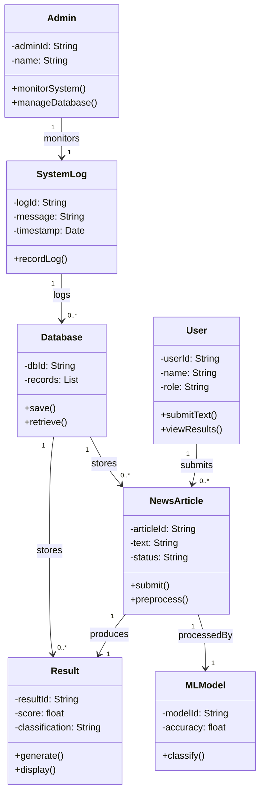

## Class Diagram Explanation

The class diagram represents the structure of the fake news detection system. 
The User interacts with the system by submitting news articles and viewing results. 
Each NewsArticle is processed by the MLModel, producing a Result. 
The Database stores both articles and results for retrieval. 
The Admin interacts with the SystemLog to monitor system performance.

The relationships ensure traceability:
- Submission aligns with user interaction use cases.
- Processing aligns with classification requirements.
- Storage aligns with data persistence requirements.
