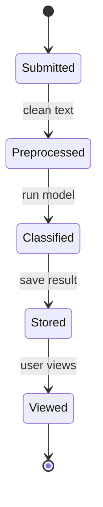
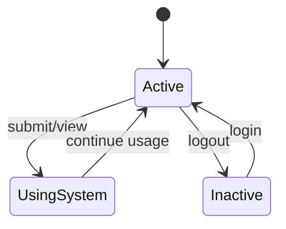
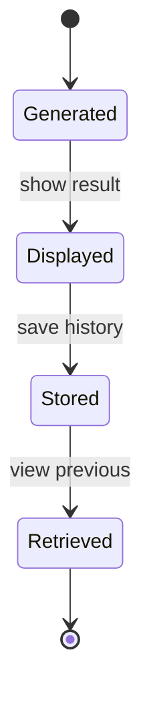
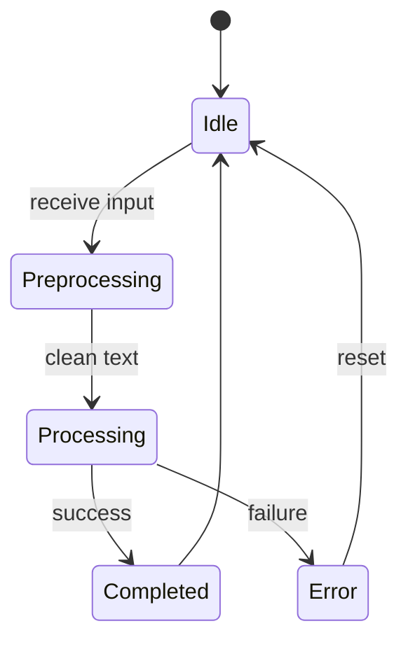
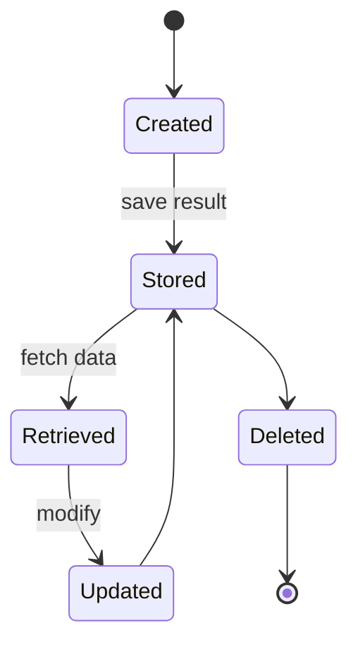
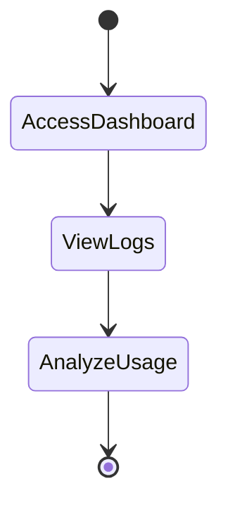
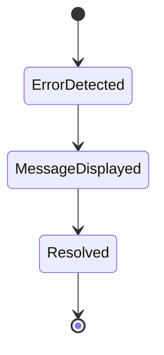

# 1. News Article State

Explanation:
This diagram shows the lifecycle of a news article from submission to final viewing. The article starts in the Submitted state when entered by the user, then moves to Preprocessed where the text is cleaned. It is then Classified using the machine learning model, after which the result is Stored in the database and later Viewed by the user.

Mapping to Functional Requirements:
- FR-001: The Submitted state represents user input of news text.
- FR-007: The Preprocessed state addresses text cleaning before analysis.
- FR-002: The Classified state represents analysis using the ML model.
- FR-004: The Stored state ensures results are saved.
- FR-003 & FR-005: The Viewed state supports displaying and retrieving results.

# 2. User State

Explanation:
This diagram represents how users interact with the system. A user becomes Active when logged in, transitions to UsingSystem when performing actions like submitting or viewing results, and returns to Inactive upon logout.

Mapping to Functional Requirements:
- FR-008: The transitions between Active and UsingSystem represent multiple users interacting with the system simultaneously.
- FR-001 & FR-005: The UsingSystem state includes submitting text and viewing previous results.

# 3. Classification Result State

Explanation:
This diagram shows how classification results are handled. Results are Generated after analysis, then Displayed to the user, stored in the database, and later Retrieved when users view previous analyses.

Mapping to Functional Requirements:
- FR-003: The Displayed state ensures the credibility score is shown.
- FR-004: The Stored state saves results in the database.
- FR-005: The Retrieved state allows users to view past analyses.

# 4. System Processing State

Explanation:
This diagram represents how the system processes input. The system starts in an Idle state, transitions to Preprocessing when input is received, then moves to Processing where analysis occurs. It ends in either Completed (success) or Error, before returning to idle.

Mapping to Functional Requirements:
- FR-007: The Preprocessing state handles text cleaning.
- FR-002: The Processing state represents analysis using the ML model.
- FR-009: The Error state ensures feedback is provided when processing fails.

# 5. Database Record State

Explanation:
This diagram shows how data is managed in the database. Records are Created, Stored, Retrieved, and optionally Updated or Deleted depending on system or admin actions.

Mapping to Functional Requirements:
- FR-004: The Stored state ensures articles and results are saved.
- FR-005: The Retrieved state allows access to previous analyses.
- FR-010: The Updated and Deleted states support administrative data management.

# 6. Admin Monitoring State

Explanation:
This diagram shows how administrators monitor the system. The admin accesses the dashboard, views logs, and analyzes system usage to ensure performance and reliability.

Mapping to Functional Requirements:
- FR-006: The ViewLogs state ensures system logs are accessible.
- FR-010: The AnalyzeUsage state supports monitoring system usage.

# 7. Error Handling State

Explanation:
This diagram represents how errors are handled in the system. When an error is Detected, a message is Displayed to the user, and the issue is then Resolved.

Mapping to Functional Requirements:
- FR-009: The MessageDisplayed state ensures users receive clear error feedback.
