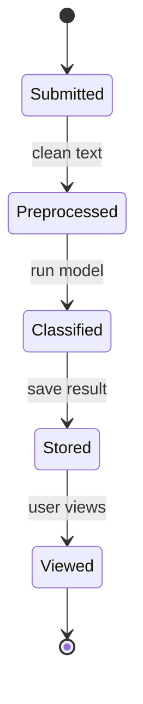
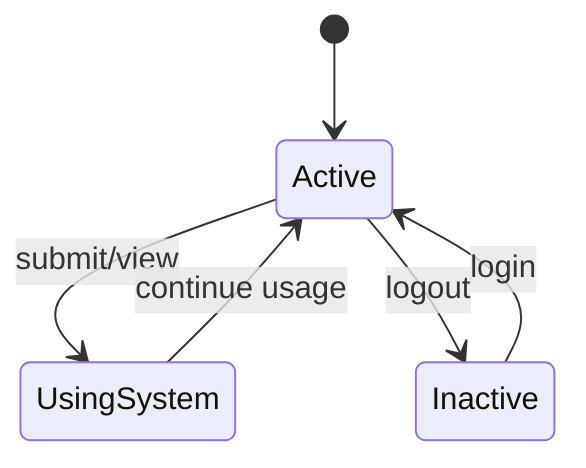
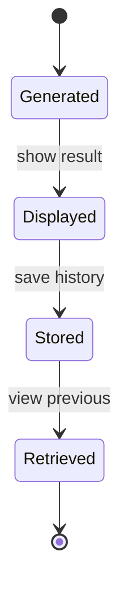
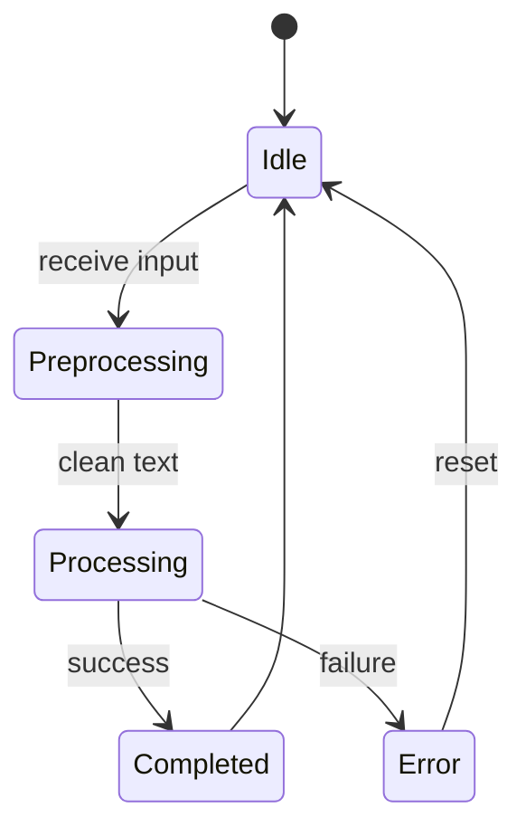
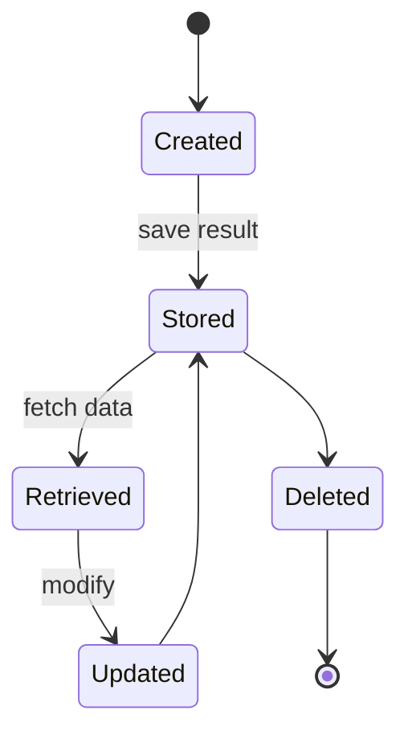
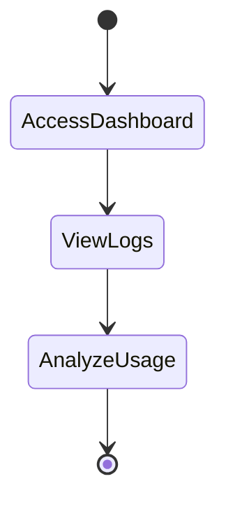
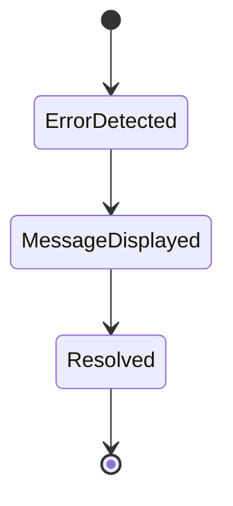

1. News Article State

```mermaid
stateDiagram-v2
[*] --> Submitted
Submitted --> Preprocessed : clean text
Preprocessed --> Classified : run model
Classified --> Stored : save result
Stored --> Viewed : user views
Viewed --> [*]
```
2. User State

```mermaid
stateDiagram-v2
[*] --> Active
Active --> UsingSystem : submit/view
UsingSystem --> Active : continue usage
Active --> Inactive : logout
Inactive --> Active : login
```
3. Classification Result State

```mermaid
stateDiagram-v2
[*] --> Generated
Generated --> Displayed : show result
Displayed --> Stored : save history
Stored --> Retrieved : view previous
Retrieved --> [*]
```
4. System Processing State

```mermaid
stateDiagram-v2
[*] --> Idle
Idle --> Preprocessing : receive input
Preprocessing --> Processing : clean text
Processing --> Completed : success
Processing --> Error : failure
Error --> Idle : reset
Completed --> Idle
```
5. Database Record State

```mermaid
stateDiagram-v2
[*] --> Created
Created --> Stored : save result
Stored --> Retrieved : fetch data
Retrieved --> Updated : modify
Updated --> Stored
Stored --> Deleted
Deleted --> [*]
```
6. Admin Monitoring State

```mermaid
stateDiagram-v2
[*] --> AccessDashboard
AccessDashboard --> ViewLogs
ViewLogs --> AnalyzeUsage
AnalyzeUsage --> [*]
```
7. Error Handling State

```mermaid
stateDiagram-v2
[*] --> ErrorDetected
ErrorDetected --> MessageDisplayed
MessageDisplayed --> Resolved
Resolved --> [*]
```
